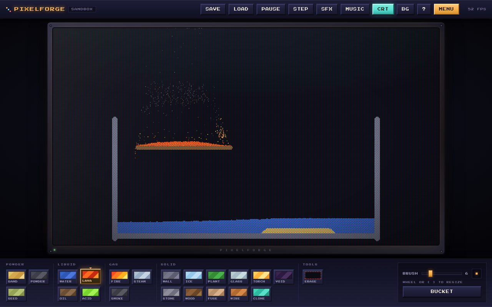
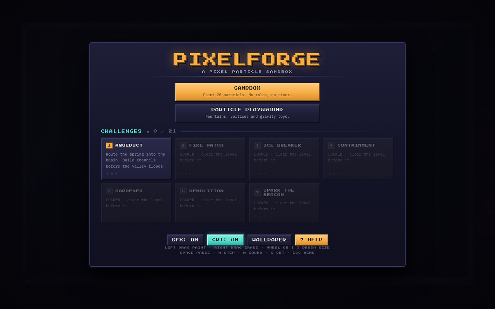

# PIXELFORGE

A pixel-art particle sandbox game for the browser. Paint falling-sand materials,
play with physics toys in the Particle Playground, and solve 7 goal-based
challenges - all simulated in a Web Worker at a fixed 60 Hz, rendered to a
640x360 canvas with an optional CRT filter.

No assets, no frameworks: TypeScript + Vite + Canvas + WebAudio, everything
procedural.

**▶ Play it: https://cloverag.github.io/pixelforge/**





---

## Run it

```bash
npm install
npm run dev       # dev server (Vite default http://localhost:5173)
```

Other scripts:

```bash
npm run build     # typecheck (tsc --noEmit) + production bundle to dist/
npm run preview   # serve the production build locally
npm run test      # vitest suite
npm run typecheck # tsc --noEmit only
```

Requires any modern browser with WebAudio + Web Workers.

## Game modes

| Mode | What it is |
|------|------------|
| **SANDBOX** | Paint any material with the brush, erase with right-click, save/load your world to browser storage. |
| **PARTICLE PLAYGROUND** | Physics toys instead of materials: fountain, firework, attractor, repulsor, vortex, wall. Gravity can be toggled (`G`). |
| **CHALLENGES** | 7 goal-based puzzles with material budgets, time limits, win/lose checks and a 3-star rating. Levels unlock in order; stars persist in `localStorage`. |

### Challenges

| # | Name | Goal |
|---|------|------|
| 1 | AQUEDUCT | Route the spring into the basin before the valley floods. |
| 2 | FIRE WATCH | Extinguish the grove fire before the wooden village burns down. |
| 3 | ICE BREAKER | Melt the glacier wall with a limited lava ration. |
| 4 | CONTAINMENT | Patch the reservoir crack before lava reaches the reactor. |
| 5 | GARDENER | Sow seeds and water them into a living meadow. |
| 6 | DEMOLITION | Breach the tower with limited gunpowder and fuse. |
| 7 | SPARK THE BEACON | Bridge the broken wire so sparks reach the beacon tower. |

Each challenge shows only its allowed materials; budgeted swatches show a
remaining-count badge and grey out when exhausted.

## Controls

| Input | Action |
|-------|--------|
| Left drag | Paint selected material / use playground tool |
| Right drag | Erase |
| Mouse wheel, `[` `]` | Brush size (2-24) |
| `F` | Toggle flood-fill bucket (sandbox) |
| `1`-`9` | Quick-select palette swatch (sandbox) |
| `SPACE` | Pause / resume |
| `N` | Single step while paused |
| `M` | Mute SFX |
| `C` | Toggle CRT filter |
| `G` | Toggle gravity (playground) |
| `ESC` | Back to menu |

Topbar buttons: SAVE, LOAD, PAUSE, STEP, SFX, MUSIC, CRT, BG (wallpaper),
? (help), MENU. SAVE/LOAD are only visible in free sandbox.

## Interface

The whole UI is one CSS file and a handful of DOM builders - no component
framework, no icon set, no images.

- The canvas sits inside an **arcade-cabinet bezel**: moulded plastic gradient,
  four case screws, an etched wordmark and a power lamp that turns amber while
  the simulation is paused. Explosions shake the entire cabinet, not just the
  picture.
- The screen has two separate layers: **glass** (a permanent diagonal sheen and
  top-edge reflection) and **CRT** (toggleable scanlines, a phosphor grille and
  a vignette).
- Palette swatches paint themselves from each material's **real 4-colour ramp** -
  the same values the simulation rasterises with - and are grouped by physical
  category (powder / liquid / gas / solid), so the toolbar doubles as a legend.
- Buttons are beveled arcade keys with real press travel; engaged toggles light
  up cyan.
- Every animation is decorative and is switched off under
  `prefers-reduced-motion`. Interactive elements carry focus rings and labels.

Re-theming means editing the tokens in the `:root` block of `styles.css`;
nothing else hard-codes a colour.

## Materials cheat sheet

Powders fall, liquids flow sideways, gases rise, solids stay put.

| Material | Behavior |
|----------|----------|
| SAND | Standard powder. |
| WATER | Flows, spreads fast. Electrified by sparks (turns to steam). |
| OIL | Lighter than water, very flammable. |
| FIRE | Short-lived gas; ignites flammables (oil, wood, plants, seeds). |
| SMOKE / STEAM | Rise and dissipate. Steam can condense back to water. |
| LAVA | Heavy hot liquid: melts ice, starts fires, dies on meltwater. |
| STONE | Solid, barely acid-soluble. |
| ICE | Solid; melts near heat into water. |
| WOOD / PLANT | Flammable solids; plants grow when drinking adjacent water. |
| SEED | Powder that sprouts into a plant when touching water. |
| ACID | Green liquid that dissolves most things (stone slowly). |
| GUNPOWDER | Powder that explodes violently on ignition. |
| FUSE | Slow-burning line for timing charges. |
| GLASS | Transparent, blast-proof solid. |
| WALL | Indestructible building block. |
| WIRE | Conducts spark pulses; energized wire glows yellow/white. |
| TORCH | Emitting spark pulses onto touching wire. |
| CLONE | Stores the first material that touches it, then emits copies of it. |
| VOID | Deletes neighboring cells. |
| EMBER | Burning residue left by fires (not placeable). |

## Architecture tour

```
index.html                 app shell: topbar / cabinet+canvas / toolbar / overlay
src/
  main.ts                  app state machine + fixed-step rAF loop + worker wiring
  styles.css               all styling (CRT filter, palettes, overlays)
  core/
    input.ts               pointer + keyboard -> simulation coords
    rng.ts                 seeded PRNG helpers
    bus.ts                 tiny event bus
  render/
    renderer.ts            presents the sim buffer to canvas, cabinet shake,
                           resize (fits the canvas inside the bezel chrome)
  sim/
    protocol.ts            message types + SIM_W/SIM_H/chunk constants
    grid.ts                typed-array cell store (cells, meta, counts)
    world.ts               cellular automaton: material rules per 60 Hz tick
    particles.ts           playground physics (attractors, fireworks, vortex)
    challenges.ts          declarative challenge defs (setup/sources/check/stars)
    worker.ts              Web Worker entry: steps the world off the main thread
  game/
    audio.ts               procedural WebAudio SFX (oscillators + noise buffer)
    rle.ts                 RLE encode/decode + localStorage save slots
    progress.ts            star progress persistence
    wallpapers.ts          background wallpaper cycling
  ui/
    hud.ts                 topbar buttons, grouped sand/playground palettes with
                           ramp-painted chips, budget badges, brush preview
    menu.ts                main menu with challenge cards + star totals
    widgets.ts             toast + result overlay helpers
    help.ts                in-game HELP overlay (? button)
    music.ts               procedural chiptune music loop (MUSIC toggle)
    tooltips.ts            hover descriptions for tools, swatches and buttons
docs/
  screenshot-*.png         README screenshots
tests/
  world.test.ts            unit tests for world rules
```

### How a frame flows

1. `main.ts` runs a rAF loop with a 60 Hz accumulator (max 6 catch-up steps).
2. Each step posts `{t:'step'}` plus a transferable `ArrayBuffer` to the worker;
   buffers ping-pong so nothing is copied.
3. The worker advances the automaton one tick, returns the frame buffer, counts,
   budgets and any challenge result.
4. `renderer.present()` blits pixels straight from the buffer; HUD updates stats;
   results open the win/lose overlay and record stars.

### Performance budget

Target is **60 FPS at 640x360**. The sim uses typed arrays and dirty-chunk
tracking (8x8 chunks); anything that drops frames gets sent back per the task
board rules.

## Project workflow

This project is built by a two-agent studio (BUILDER + MANAGER/REVIEWER).
Tasks, claims and review notes live in [TASKS.md](./TASKS.md).

## Deploy

Pushing to `main` runs [`.github/workflows/deploy.yml`](.github/workflows/deploy.yml),
which typechecks, runs the tests, builds, and publishes `dist/` to GitHub Pages.
A failing typecheck or test never ships.

The site is fully static - no server, no API - so it needs nothing beyond a file
host. `vite.config.ts` sets `base: './'`, and the worker and wallpapers resolve
through `import.meta.url`, so the build works from any subpath.
